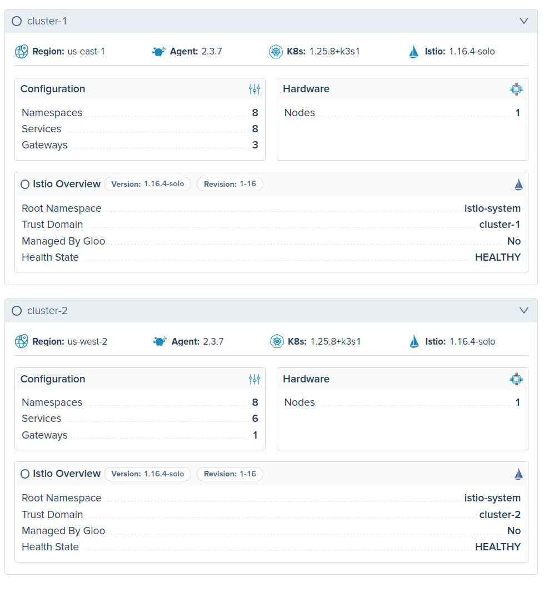
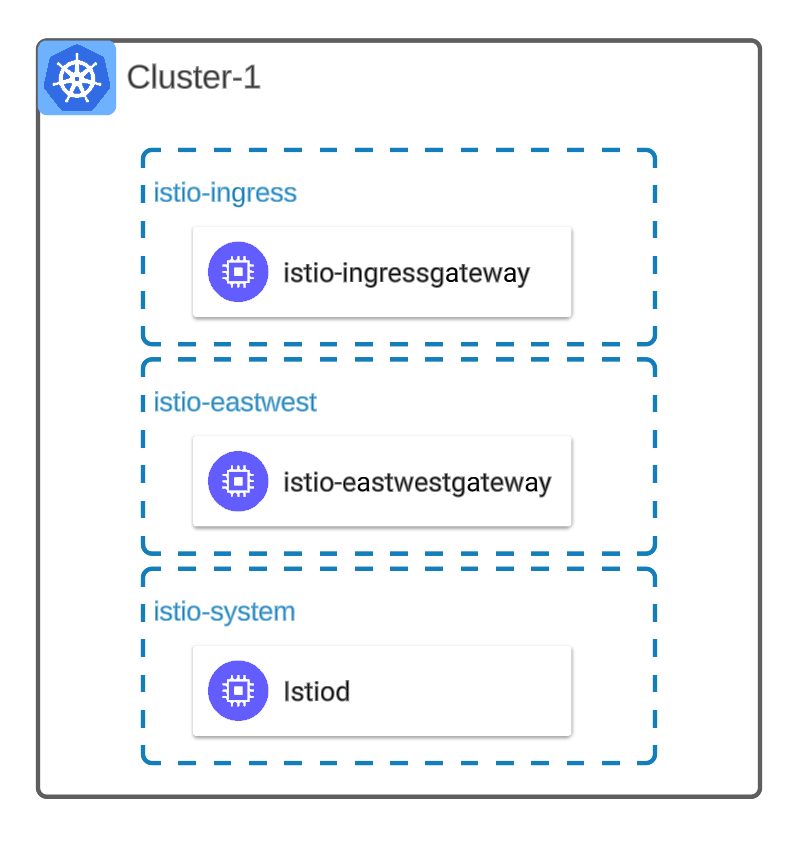
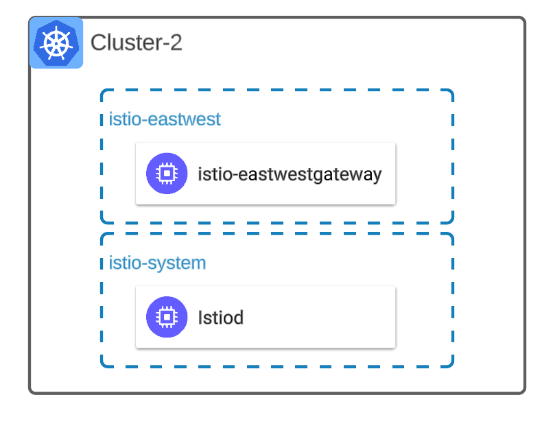

## Lab 03 - Deploy Istio <a name="lab-03---deploy-istio-"></a>




Gloo Platform works with Open Source Istio distributions, but Solo.io offers a number of different distributions of Istio for different types of environments and use cases such as FIPS, Arm, and distroless.
To learn more about the different distributions view [Gloo Istio Distributions](https://docs.solo.io/gloo-mesh-enterprise/latest/reference/version/gloo_mesh_istio/).

Links:
- [Gloo Istio](https://docs.solo.io/gloo-mesh-enterprise/latest/reference/version/gloo_mesh_istio/)
- [Supported Istio Versions](https://docs.solo.io/gloo-mesh-enterprise/latest/reference/version/versions/)
- [Gloo Platform Managed Istio](https://docs.solo.io/gloo-mesh-enterprise/latest/setup/installation/istio/gm_managed_istio/)
- [Manual Istio Installs](https://docs.solo.io/gloo-mesh-enterprise/latest/setup/prod/manual/)

Installing Istio via `helm` is the preferred method for installing Istio manually. If you prefer to not manage you Istio installations you can trust that responsibility to Gloo Platform via its Istio [Istio Lifecycle Manager](https://docs.solo.io/gloo-mesh-enterprise/latest/setup/installation/istio/gm_managed_istio/)
Istio will be installed using `revisions` which is the optimal way to deploy Istio for production environments. It allows for the ability to **canary** Istio components that is safe and will prevent outages.

* First add the Istio helm repositories
```shell
helm repo add istio https://istio-release.storage.googleapis.com/charts
helm repo update
```

## Install Istio on Cluster: remote-1



* Create `istio-system`, `istio-eastwest`, `istio-ingress` namespaces
```shell
kubectl apply --context r1 -f data/namespaces.yaml
```

* Before installing Istio or upgrading the istio/base must be run to install or reconcile the CRDs within the kubernetes cluster. 
```shell
helm upgrade -i istio-base istio/base \
  -n istio-system \
  --version 1.21.2 \
  --set defaultRevision=1-21 \
  --kube-context=r1
```

* Install the `istiod` control plane 
```shell
helm upgrade -i istiod-1-21 istio/istiod \
  --set revision=1-21 \
  --version 1.21.2 \
  --namespace istio-system  \
  --kube-context=r1 \
  --set "global.multiCluster.clusterName=remote-1" \
  --set "meshConfig.trustDomain=remote-1" \
  -f data/istiod-values.yaml
```

* Install the Istio eastwest gateway which is used for multi-cluster communication between clusters using mTLS.
```shell
helm upgrade -i istio-eastwestgateway istio/gateway \
  --set revision=1-21 \
  --version 1.21.2 \
  --namespace istio-eastwest  \
  --kube-context=r1 \
  -f data/eastwest-values.yaml
```

* Install the Istio ingress gateway with a ClusterIP service type. For best proudction practices and to support multiple revisions a standalone Service will be created to allow easy migration of traffic.
```shell
helm upgrade -i istio-ingressgateway-1-21 istio/gateway \
  --set revision=1-21 \
  --version 1.21.2 \
  --namespace istio-ingress  \
  --kube-context=r1 \
  -f data/ingress-values.yaml
```

* Create the standalone Kubernetes service to sit in front of the Istio ingressgateway.
```shell
kubectl apply --context r1 -f - <<EOF
apiVersion: v1
kind: Service
metadata:
  name: istio-ingressgateway
  namespace: istio-ingress
  annotations:
    service.beta.kubernetes.io/aws-load-balancer-type: "external"
    service.beta.kubernetes.io/aws-load-balancer-nlb-target-type: "instance"
    service.beta.kubernetes.io/aws-load-balancer-scheme: "internet-facing"
  labels:
    istio: ingressgateway
    app: gloo-gateway
spec:
  type: LoadBalancer
  selector:
    istio: ingressgateway-1-21
  ports:
  # Port for health checks on path /healthz/ready.
  # For AWS ELBs, this port must be listed first.
  - name: status-port
    port: 15021
    targetPort: 15021
  # main http ingress port
  - port: 80
    targetPort: 8080
    name: http2
  # main https ingress port
  - port: 443
    targetPort: 8443
    name: https
EOF
```

* Verify pods are running
```bash
kubectl get pods --context r1 -n istio-system
kubectl get pods --no-headers --context r1 -n istio-ingress
kubectl get pods --no-headers --context r1 -n istio-eastwest
```

* Verify the load balancer is created`
```shell
kubectl get service --context r1 -n istio-ingress
kubectl get service --context r1 -n istio-eastwest
```

## Install Istio on Cluster: remote-2



* Create `istio-system`, `istio-eastwest`, `istio-ingress` namespaces
```shell
kubectl apply --context r2 -f data/namespaces.yaml
```

* Install the Istio specific CRDs
```shell
helm upgrade -i istio-base istio/base \
  -n istio-system \
  --version 1.21.2 \
  --set defaultRevision=1-21 \
  --kube-context=r2
```

* Install the `istiod` control plane 
```shell
helm upgrade -i istiod-1-21 istio/istiod \
  --set revision=1-21 \
  --version 1.21.2 \
  --namespace istio-system  \
  --kube-context=r2 \
  --set "global.multiCluster.clusterName=remote-2" \
  --set "meshConfig.trustDomain=remote-2" \
  -f data/istiod-values.yaml
```

* Install istio eastwest gateway
```shell
helm upgrade -i istio-eastwestgateway istio/gateway \
  --set revision=1-21 \
  --version 1.21.2 \
  --namespace istio-eastwest  \
  --kube-context=r2 \
  -f data/eastwest-values.yaml
```

* Verify pods are running
```bash
kubectl get pods --context r2 -n istio-system
kubectl get pods --no-headers --context r2 -n istio-eastwest
```

* Verify the load balancer is created
```shell
kubectl get service --context r2 -n istio-eastwest
```

